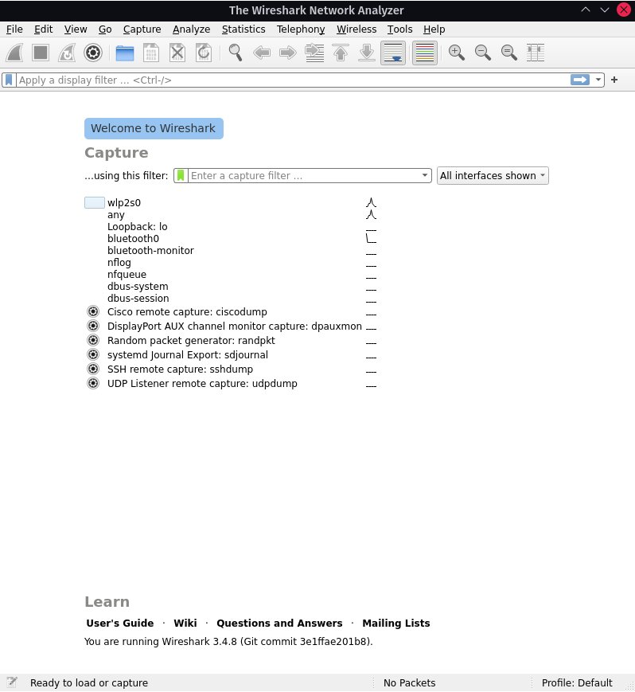

# RSX1 SABIR 

# UDP : 

### Question 1 : 

<p>  

la commande `ip -brief address show me ` donne comme résultats:
<br>

```


lo               UNKNOWN        127.0.0.1/8 ::1/128 
eth0             DOWN
eth1             UP             192.168.5.51/24 metric 100 fe80::e654:e8ff:fe59:84ec/64 

192.168.5.51 l'addresse IP de mon Poste de travail 


```


</p>

### Question 2 : 

<p>

`socket udp` crée une socket avec l'id 3 

```

The socket identifier is 3


```


</p>

### Question 3 : 

```

 
 Id  Proto   Local address              Remote address             TYPE  RWX ?
---------------------------------------------------------------------------------
>3   UDP U   -                          -                          ipv4  .W.


```

<p> La commande donne l'état de la socket UDP qu'on vient de créer </p>

### Question 4 : 
<p>

 ` bind 3 192.168.5.51 3000  ` 
</p>

### Question 5 : 

<p>

` sendto 3 192.168.5.52 3000 "Hello" ` avec `192.168.5.52 ` l'addresse IP de mon voisin 
mon voisin est censé recevoir le message `Hello` sur son terminal socklab en écrivant
`recvfrom 3 6 `


</p>

### Question 6 : 

<p>
Mon voisin doit me fournir son addresse IP afin que je puisse lui envoyer un message .


</p>

### Question 7 : 

<p>

`recvfrom 3 21`

</p>

```


A message of length 21 bytes was received from b05p2.fil.univ-lille.fr (52864).
Message=<coucou comment vas tu>
le message envoyé par mon voisin 


```

### Quesiton 8 : 

<p>

Il est preferable de laisser le systeme choisir le port sur la machine qui le recoit , 
ca evitera d'avoir plusieurs messages recu sur le meme port vu que la machine qui recoit
le message est celle qui connait les ports deja occupé.

</p>

### Question 9 : 

<p>

`close 3 `
ferme le socket d'id 3 

</p>

### Quesiton 10 : 


```

socket UDP
socket UDP

status
 Id  Proto   Local address              Remote address             TYPE  RWX ?
 ---------------------------------------------------------------------------
 3   UDP U   -                          -                          ipv4  .W.
 4   UDP U   -                          -                          ipv4  .W.
 
 bind 3 * 0
 The socket was attributed port 35242.

 bind 4 * 0
 The socket was attributed port 52934.
 
 	>>>statuts
  Id  Proto   Local address              Remote address             TYPE  RWX ?
 ---------------------------------------------------------------------------
 3   UDP U   *(47638)                   -                          ipv4  .W.
 4   UDP U   *(39590)                   -                          ipv4  .W.
 


```

### Question 11 :

 `sudo wireshark -i lo -f udp`

 

 ### Question 12 : 

<p> 

l'addresse IPv4  associé associé à l'interface de loopback est `127.0.0.1`

</p>

### Question 13 : 

```

sendto 4 127.0.0.1 39590 "Comment allez-vous?"
sent 19 bytes 

```
 
 


### Question 14 : 

```
 sendto 3 127.0.0.1 47638 "Tres bien.Merci!" 
 sent 16 bytes 

```


### Question 15 : 

```

Destination
	127.0.0.1 UDP 61 39590 -> 47638 Len=19
	127.0.0.1 UDP 58 47638 -> 39590 Len=16

```

Sur les deux captures ci-dessous , on peut constater qu'il y a 3 types de données marquantes : 

- Type détaillé 
 > Permet d'avoir toutes les infos sur les différentes trames reçues.

- Type avec toutes les réceptions
 > Permet de sélectionner des lignes à détailler.

- un Type de données  contenant 
 > Permet d'avoir les infos sur les octets contenus dans le message.

<p> 

En analysant un peu plus, on retrouve en source / destination l'adresse locale de l'ordinateur `127.0.0.1` désignant son adresse de `loopback`, le protocole `UDP` utilisé pour transmettre les infos et choisi pour nos sockets de communications et dans `info` les ports de départ et de réception sous la forme : `port_départ -> port_reception` 

</p>

<br>

Diagramme :


```

IP : 127.0.0.1                 IP : 127.0.0.1
Port : 39590                    Port : 47638
    |                                 |
    | message = "Comment allez-vous ?"|
    |__________                       |
    |          ‾‾‾‾‾‾‾‾‾‾‾‾——————————>|
    |                                 |
    |                                 |
    |  message = "Très bien. Merci!"  |
    |                       __________|
    |<——————————‾‾‾‾‾‾‾‾‾‾‾‾          |
    |                                 |
    |                                 |


```

<br>

d) 
> Pour le premier message : 20 / 62 = ~1/3  
> Pour le second message  : 19 / 60 = ~1/3  

### Question 16 : 

```
close 3 
close 4 

```


# TCP :

### Question 1 : 
<p>
 Création de deux sockets TCP
</p>

```

socket tcp
socket tcp

```

<p>
 On associe à la première Socket d'id 3 l'addresse IP 127.0.0.1
 </p>

```
 celle de loopback et le port 3000 et à la deuxième socket d'id 4 la même ip mais avec le port 4000.
 bind 3 127.0.0.1 3000
 bind 4 127.0.0.1 4000

 status

 Id  Proto   Local address              Remote address             TYPE  RWX ?
 ---------------------------------------------------------------------------
 3   TCP     127.0.0.1(3000)            -                          ipv4  RW.
 4   TCP     127.0.0.1(4000)            -                          ipv4  RW.

```

### Question 2 :

```
sudo wireshark -i lo -f 'tcp port 3000' &
[4] 34085

```

### Question 3 : 


```

ss -ant4 

```

<p>

On peut voir que la connection nous est refusée, quand l'on regarde l'output de `ss -ant4`, on ne trouve d'ailleurs aucun de nos sockets 

</p>

### Question 4 : 

```

connect 3 127.0.0.1 4000
on a comme résultat 
connect(): Connection refused 

```

### Question 5 : 

```

listen 4 2
deux connexions maximum.

```

### Question 6 : 

<p>
 La socket serveur est la socket 2, elle attend les connections d'autres sockets (clientes) comme la socket 1
 </p>

### Question 7 :

```

connect 3 127.0.0.1 4000
Connection established.

```

<p>Sur wireshark on capture les informations suivantes : </p>

```

Frame 4: 74 bytes on wire (592 bits), 74 bytes captured (592 bits) on interface lo, id 0
Ethernet II, Src: 00:00:00_00:00:00 (00:00:00:00:00:00), Dst: 00:00:00_00:00:00 (00:00:00:00:00:00)
Internet Protocol Version 4, Src: 127.0.0.1, Dst: 127.0.0.1
Transmission Control Protocol, Src Port: 3000, Dst Port: 4000, Seq: 0, Len: 0
    Source Port: 3000
    Destination Port: 4000
    [Stream index: 1]
    [TCP Segment Len: 0]
    Sequence number: 0    (relative sequence number)
    Sequence number (raw): 2947765337
    [Next sequence number: 1    (relative sequence number)]
    Acknowledgment number: 0
    Acknowledgment number (raw): 0
    1010 .... = Header Length: 40 bytes (10)
    Flags: 0x002 (SYN)
    Window size value: 65495
    [Calculated window size: 65495]
    Checksum: 0xfe30 [unverified]
    [Checksum Status: Unverified]
    Urgent pointer: 0
    Options: (20 bytes), Maximum segment size, SACK permitted, Timestamps, No-Operation (NOP), Window scale
    [SEQ/ACK analysis]
    [Timestamps]


```

<p> Lorsque l'on arrive à se connecter on remarque que la socket serveur envoie un message à la socket client pour dire que la connection a été acceptée </p>

### Question 8 : 
<p>  

`accept 4`

Quand l'on a fait accept, on a pu constater l'apparition d'une socket avec pour id 5 (que l'on nommera S3) qui utilise le même port (4000) que la socket S2. On a aussi pu constater que les sockets S1 et S3 sont positionnées sur l'adresse `127.0.0.1` qui est l'adresse `loopback` à la place de `*` (toutes les adresses), elles ont aussi une adresse distante qui est apparue, l'adresse distante de S1 est l'adresse locale de S3 et inversement.

</p>

### Question 9 : 


```
 
Id  Proto   Local address              Remote address             TYPE  RWX ?
---------------------------------------------------------------------------
3   TCP     127.0.0.1(3000)            127.0.0.1(4000)            ipv4  .W.
4   TCP     127.0.0.1(4000)            -                          ipv4  ...
5   TCP     127.0.0.1(4000)            127.0.0.1(3000)            ipv4  .W.

on peut voir la connexion établie entre le socket 3 et le socket 4 avec l'id de la connexion 5 

```

### Question 10 : 

```
write 5 "Ça va?"
write 5 "this is a test"
sent 8 bytes

```

### Question 11 :

<p>

Deux nouvelle lignes sont apparues sur l'analyse `Wireshark`, une première allant du port 3000 au port 4000 et avec une longueur de 20 (comme notre message) et un acquittement de 1. Sur la seconde ligne, on peut d'abord voir que l'on va du port 4000 au port 3000 puis voir que la taille est de 0 et l'acquittement lui fait maintenant 21 octets.

</p>

<p>  a)  Si le flag PSH n'était pas apparu, on pourrait en déduire que le contenu du message n'aurait pas été envoyé.


</p>

<p> 
b)

<br>

Selon le wiki :
> By default Wireshark and TShark will keep track of all TCP sessions and convert all Sequence Numbers (SEQ numbers) and Acknowledge Numbers (ACK Numbers) into relative numbers. This means that instead of displaying the real/absolute SEQ and ACK numbers in the display, **Wireshark will display a SEQ and ACK number relative to the first seen segment for that conversation.**  
([Source](https://wiki.wireshark.org/TCP_Relative_Sequence_Numbers))

Ce numéro correspond donc au premier segment récupéré pour une conversation x ou y.


</p>

<p>

c) Même réponse que la question précédente. Le 21 correspond ici au `SEQ` du prochain message par cette socket.


</p>


<p>

d) `21 - 1 = 20`; on retrouve la taille de notre paquet envoyé.

</p>

### Question 12 : 

<p> 
Le champ "Recv-Q" correspond à la taille des messages reçus et non lus.

</p>

### Question 13 : 

<p>L'Id socket correspond ici à l'Id renvoyé par `accept`.</p>

### Question 14 : 

La valeur de ce champ passe maintenant à 0

### Question 15:

<p>
La commande `shutdown` permet d'empecher l'entrée et / ou la sortie de messages sur une socket. Ici, on a pu fermer la sortie de la socket S1 à l'aide de cette commande. Cela est par ailleurs confirmé lorsque l'on tente de renvoyer un message depuis la socket S1.</p>
<p>
Par ailleurs, on peut voir qu'un tag `FIN` est apparu avec un `SEQ` égal à notre `ACK` précédent et le "message" capturé après a un `ACK` égal au `SEQ` précédent `+1`.
</p>

### Question 16 : 

On va ici envoyer le message depuis la socket S3.

```
write 5  "Tres bien. Merci !"
    read 4 18 

```
### Quesiton 17: 

 On va remarquer la même chose que lors de la question 15 lors de l'analyse.
 
 `shutdown 5`

### Question 18 : 
a) 


```

IP : 127.0.0.1                 IP : 127.0.0.1
Port : 3000                    Port : 4000
    |                                 |
    | message = "Comment allez-vous ?"|
    |__________                       |
    |          ‾‾‾‾‾‾‾‾‾‾‾‾——————————>|
    | SYN=1?; ACK=20; FIN=6?; N°seq=4 |
    |                                 |
    |                                 |
    |  message = "Très bien. Merci!"  |
    |                       __________|
    |<——————————‾‾‾‾‾‾‾‾‾‾‾‾          |
    | SYN=2?; ACK=22; FIN=10?; N°seq=8|
    |                                 |


```

b)   b) 11 segments ont été transmis pour effectuer toute cette communication. C'est quasiment le double de ce que l'on avait lors de la communication UDP.

c)
> Pour le premier message : 20 / 86 = 1/4,3  
> Pour le second message  : 19 / 85 = ~1/4,3  

<p> On passe de 1/3 à 1/4,3 pour le rapport d'efficacité, on peut donc ressentir une perte. </p>
