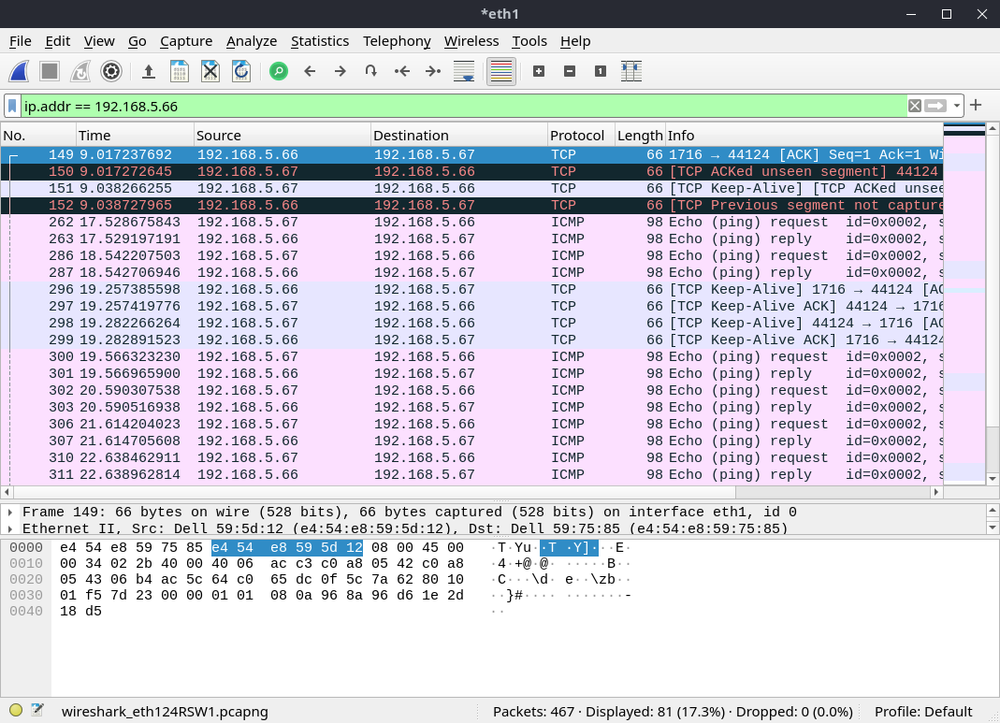

# Réponses Concernant la partie Adressage du TP4 

## Question 1 :
<p>
en éxecutant la commande ifconfig on aura des informations sur les interfaces connectées au réseau de la salle de TP dont "eth1"


```
    ifconfig 
    Nom de l'interface : eth1: flags=4163<UP,BROADCAST,RUNNING,MULTICAST>  mtu 1500
    Adresse IPv4 :  192.168.5.67 
    Adresse IPv6 : fe80::e654:e8ff:fe59:7585
    Adresse MAC : e4:54:e8:59:75:85
    
```
</p>

## Question 2 :
<p> La vitesse maximale est de 1000 mbps . Cette vitesse n'est pas la vitesse maximale supportée par l'interface eth1.

```
Commande ethtool eth1 | less 
    Vitesse actuelle de l'interface : 1000Mb/s
    Quel est le mode duplex : Full duplex
    l'interface est-elle bien connectée : Oui car on a Link Detected : Yes 

```

</p>

## Question 3:

<p>

L'adresse IP étant  `192.168.5.67 ` , on a les informations suivantes :

- Routage :
    - Cette adresse est routable sur un réseau local par contre elle ne sera pas routable sur internet étant donné que son adresse de diffusion est comprise entre `192.168.0.0` à
    `192.168.255.255`.

- Misc :
    - L'adresse IPv4 donnée est de la classe C . ( Une adresse comprise entre `192.0.0.0` à `223.255.255.0`)
    - Son adresse au format CIDR sera `192.168.1.71/24`
    - Son masque est `255.255.255.0`
 
- Adressage : 
    - Son adresse de diffusion sera `192.168.1.255`
    - On pourra adresser 253 hôtes sur le réseau de la salle (sans `192.168.1.0` qui sera l'adresse d'écoute et l'adresse de diffusion.)

</p>

## Question 4 : 

(sudo route -6)

- Adressage :
    - On peut adresser 2<sup>64</sup> adresses sur ce réseau.

- Misc :
    -  IPv6 est ici `fe80:0000:0000:0000:c495:cd1c:68dc:7a54/64`
    - Le masque étant de 64, les 16 octets du masque sont `fe80:ffff:ffff:ffff:0000:0000:0000:0000`.

- Routage :
    - Cette adresse est routable sur un réseau local.
    - Elle n'est pas routable sur internet.
    - L'étendue de cette adresse sera `fe80:0000:0000:0000:0000:0000:0000:0000` ~ `fe80:0000:0000:0000:ffff:ffff:ffff:ffff`.


## Question 5 : 

<p> Pour tester la connectivité Ipv4 et IPv6 avec celle de notre voisin on fait un ping sur son adresse IP et on analyse les paquets envoyés/reçus sur wireshark  </p>

## Question 6 : 


## Question 7 : 
<p>
Le protocole utilisé pour tester la connectivité IP est ICMP.
Le type est IPv4  et le code des messages de requête et de réponse :  0x0800.

</p>

## Question 8 : 




## Question 9 : 

- L'adresse MAC de la requête est `Dell_59:75:85`. 
- La question est `Who has 192.168.5.67? Tell 192.168.5.66`

## Question 12 :

<p>

Ethernet :
- Couche réseau.
IP :
- Couche liaison|transport.
ICMP :
- Couche physique.

</p>

## Question 13 : 

<p>

Une analogie utile pour comprendre pourquoi utiliser l'adresse IP plutot que l'adresse MAC dans les connexions réseau est de voir cela de la façon suivante :
- Le routeur correspond à une ville / un village
- Chaque adresse locale disponible sur le réseau de ce routeur correspondent à des adresses physiques dans ce village / cette ville
- L'adresse MAC elle correspond au nom de la personne à qui est attribuée la boite postale disponible à cette adresse

Lorsque l'on va envoyer une lettre à quelqu'un, ce qui va permettre à la lettre d'arriver à destination ne sera pas le nom de la personne mais l'adresse qui sera notée sur celle ci. Ça sera la même chose avec les adresses IP et adresses MAC, l'adresse IP est référencée dans le réseau et permet de retrouver la machine facilement pour lui envoyer un message, l'adresse MAC sert juste à donner un nom à cette machine.

</p>