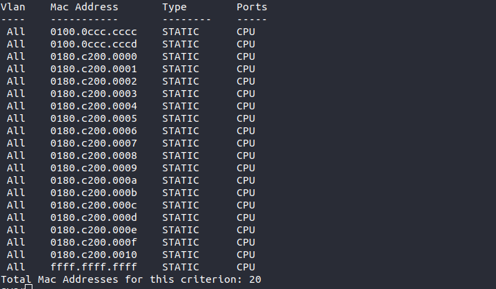

## Commutateur (switch)

### Question 1 : 

On constate que les postes arrivent à communiquer. On constate d'ailleurs qu'en plus d'échanger des requetes en utilisant le protocole ARP entre deux postes, le poste envoyant le `ping` envoie des requêtes ARP à l'adresse de diffusion. On peut donc supposer que les communications se font transmettre de notre poste au switch avant de pouvoir être échangées entre les deux IP.

### Question 2 : 

On passe ici en full-duplex, c'est à dire que les informations peuvent aller dans les deux sens à la fois.

### Question 2 : 

On retrouve ici dans les deux cas une topologie en étoile, tout transite par le switch.

### Question 3 : 

On retrouve ici dans les deux cas une topologie en étoile, tout transite par le switch.

### Question 4 : 

### Question 5 : 

Le switch obtient ces addresses grâce au fait que tous ces appareils y sont connectés physiquement.

`ifconfig` => ` e4:54:e8:59:75:85`

### Question 6 : 

Pour fonctionner correctement, le switch aura besoin des adresses MAC afin de communiquer. ON peut donc en déduire que ces appareils vont intervennir au niveau physique.

### Question 7 : 

L'avantage du switch est qu'il simule le fait que plusieurs postes soient "le même" là où le hub va seulement les connecter sur le même réseau.

### Question 8 : 

Il n'est pas possible qu'une interface dispose de plusieurs adresses ethernet. Par contre, une même adresse pourrait être associée à plusieurs interfaces d'un commutateur.

### Question 9 : 

On constate que seule l'adresse du switch est utilisée en tant que source. 

### Question 10 : 

On constate lorsque l'on ping cette adresse que le ping va être diffusé à l'aide de l'IPv6 plutot que de l'adresse ethernet du switch.

