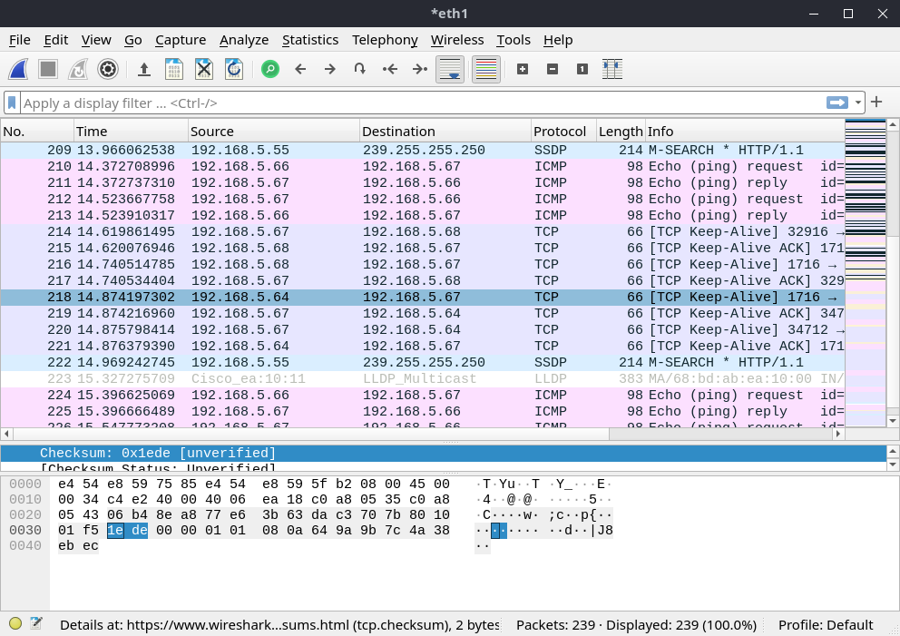
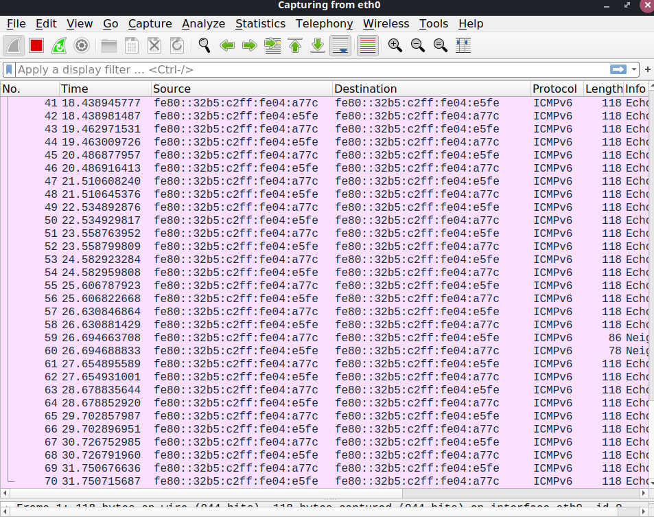

# Concentrateur (hub)

### Question 1 : 

<p>

On constate que l'on voit bien une communication entre les deux postes .




</p>

### Question 2 : 


<p>

Le mode `promiscuous` (mot anglais voulant dire "qui ne fait pas de différences") permet d'observer tous les échanges faits entre n'importe quelles machines connectées au même hub que notre machine.

</p>

> Une fois ce mode désactivé, on obtient la capture suivante :
> 

### Question 3:

<p>

Les interfaces en sont connectées en half-duplex au hub . Les interfaces ne peuvent pas émettre et recevoir en même temps , ça sera soit l'un soit l'autre .


</p> 


### Question 4 : 

<p>

 - la topologie physique :
    Une topologie en étoile c'est à dire que tous les postes sont connectés au hub et non entre eux . 


 - la topologie logique : Topologie en Bus .
    
</p>

### Question 5 : 

<p>

Faut que mon voisin fasse `iperf -c 192.168.5.67`
En exécutant `iperf -s` sur mon poste j'ai comme résultat :

```

iperf -s
------------------------------------------------------------
Server listening on TCP port 5001
TCP window size:  128 KByte (default)
------------------------------------------------------------
[  1] local 192.168.5.67 port 5001 connected with 192.168.5.66 port 60142
[ ID] Interval       Transfer     Bandwidth
[  1] 0.0000-10.0182 sec  1.09 GBytes   934 Mbits/sec


```

<br>

Les postes connectés entre eux via des concentrateurs forment un domaine de collision.
Pour voir les valeurs du compteur de collisions faut qu'on tape ` ip -0 link afstats dev eth1`


Les postes connectés entre eux via des concentrateurs forment un **domaine de collision**.

</p>

