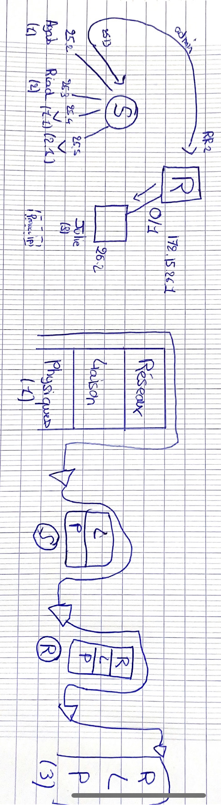

# Routeur : 


### Question 1 : 

<p>


172.16.0.0/24 ( adresse réseau )
172.16.1.0/24 ( 2 eme sous réseau ) 

```

sh
$ sudo ip addr add 172.16.0.1/24 dev eth0

```


```

sh
$ sudo ip addr add 172.16.0.2/24 dev eth0


```

```

sh

$ sudo ip addr add 172.16.1.1/24 dev eth0


```


</p>

### Question 2 : 


<p>

```

enable
configure terminal
interface fastEthernet 0/0
ip address 172.16.0.254 255.255.255.0
no shutdown

interface fastEthernet 0/1
ip address 172.16.1.254 255.255.255.0
no shutdown

exit

ip routing

```


</p>

### Question 3 :

<p>

L'utilité du TTL est d'éviter les boucles, si un paquet arrive à un TTL de 0, le routeur le rejettera.

Comme le paquet partant de la machine 2 a besoin de passer par le switchh avant d'arriver au routeur, il a besoin de plus longtemps pour arriver au routeur et son TTL aura donc été décrémenté.


</p>

### Question  4 : 

<p>


On aurait besoin d'un TTL de 1, le switch redistribuerait directement sans "lag" au poste 2 ce qui vient du poste 1 mais pas au routeur qui lui recevra un paquet expiré.


</p>

### Question 5 : 

<p>


L'adresse MAC source de la trame reçue sur le poste 3 correspond à l'adresse MAC du routeur sur l'interface 0/1. Tandis que l'adresse MAC de destination à partir du poste 1 sera l'adresse MAC du routeur sur l'interface 0/0.


</p>

### Question 6 : 


<p> 

Le poste 1 arrive à le savoir grâce à sa table de routage qui lui montre que le poste 3 n'est pas de son réseau. 


</p>

### Question 7 : 

<p>




</p>

### Question 8 : 

<p> 

Le routeur ne prend pas en compte les pings de diffusion, par conséquent, le ping du poste 1 sera reçu par le poste 2 mais pas par le poste 3.


</p>

### Question 9 : 

<p>

Le routeur ne transmettant pas les pings de diffusion, les postes 1 et 2 ne reçoivent rien.

    Exécutez les commandes suivantes sur le routeur : <br>
    _Router(config)#interface fastEthernet 0/0_ <br>
    _Router(config-if)#ip directed-broadcast_


</p>

### Question 10 : 

<p>

Le transfert de la diffusion permet au poste 3 de recvoir un ping de diffusion du poste 1. Cette possibilité est désactivée de base pour éviter des failles de sécurité (e.g.: DDOS)


</p>

### Question 11 : 

<p>

La diffusion limitée utilise l'adresse broadcast avec une portée donc limitée aux hôtes du réseau local, tandis que la diffusion dirigée qui utilise aussi l'adresse broadcast n'est pas nécessairement local même si elle est limitée aux hôtes du réseau. L'unicast est une connexion point à point, donc d'un hôte vers un seul autre hôte.


</p>

### Question 12 : 

<p>


Avec la diffusion limitée, le routeur bloquera le ping du broadcast, tandis qu'avec la diffusion dirigée il ne bloquera pas. Il accepte aussi l'unicast. La différence entre un routeur et un switch vis-à-vid de la diffusion IP est que le switch peu importe le type de paquets, il enverra tout le temps alors que le routeur fera attention en fonction du type de paquets.


</p>

### Question 13 :

<p> ça a été fait </p>